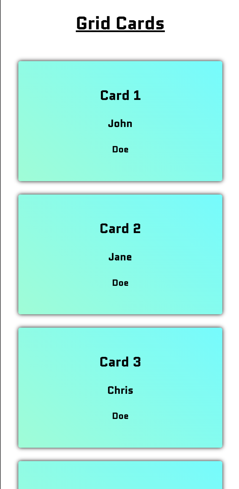
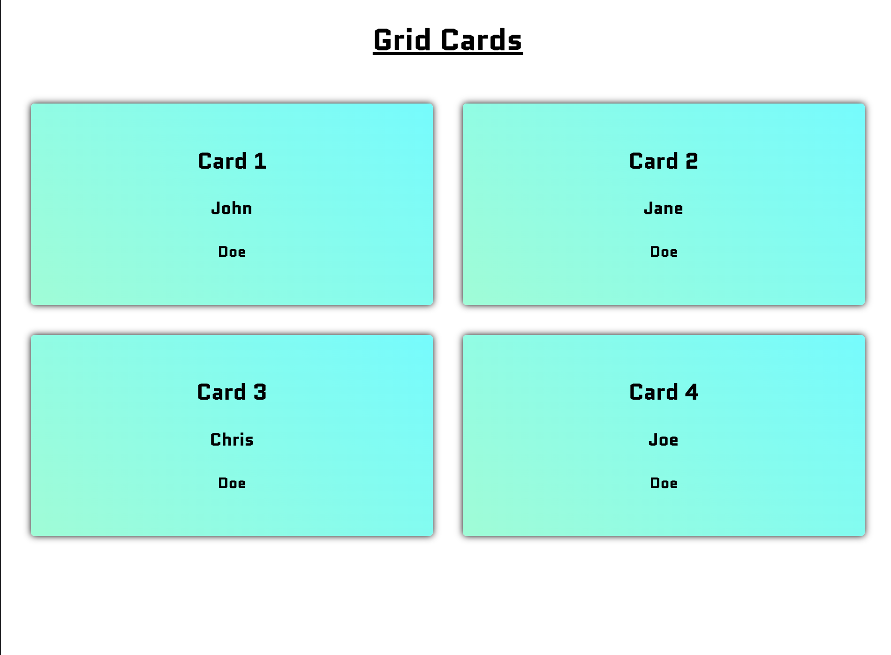
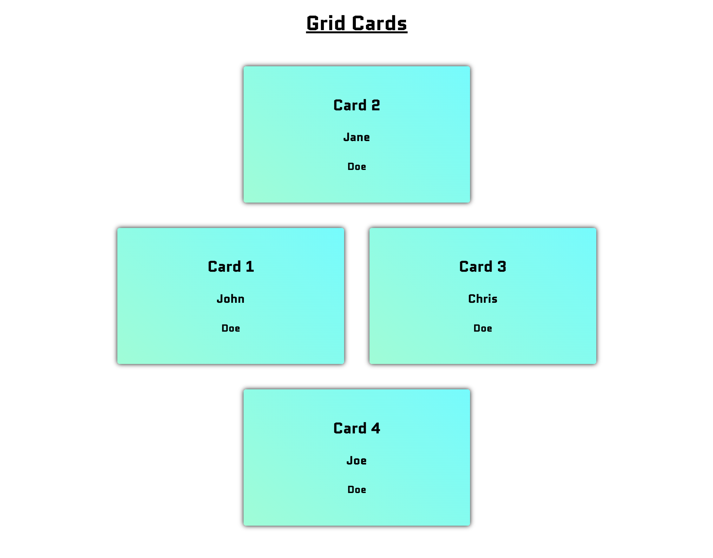

# grid-cards
Responsive layout with four cards.

## Mobile layout
Single column grid layout

## Tablet layout
Two column grid layout

## Desktop layout
Two column grid layout with cards stacked in a clockwise layout.
Changing classnames on the unordered list can change the approach:
- Default class: "area" - uses clockwise layout
- No class name: grid layout normal
- Class: area-grid: uses grid area template for clockwise display
